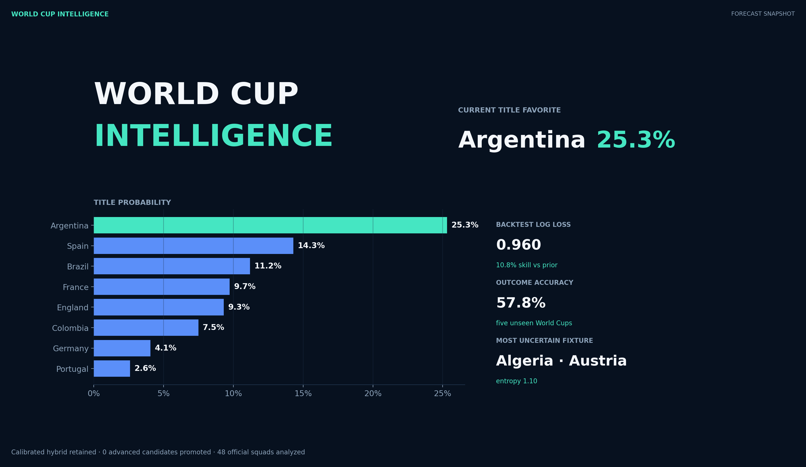
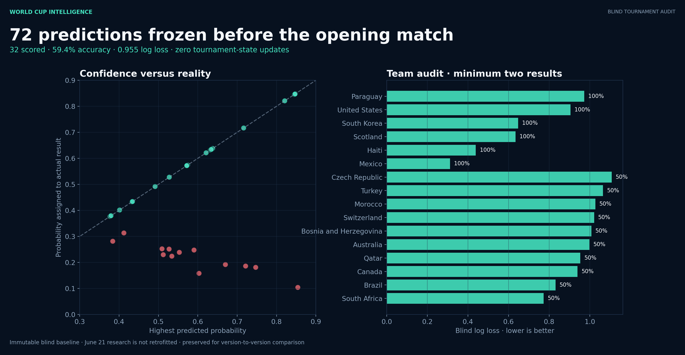
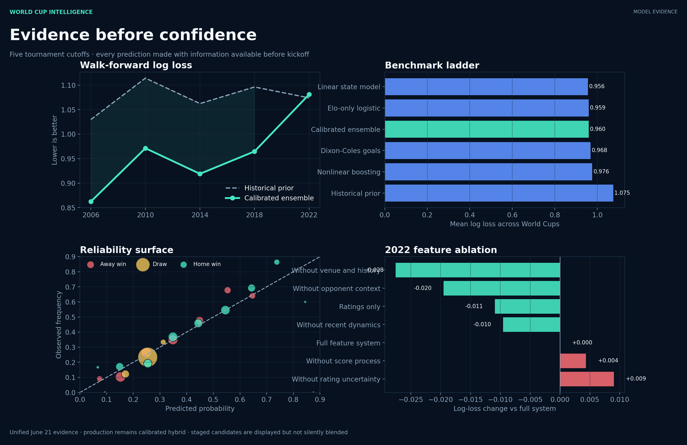
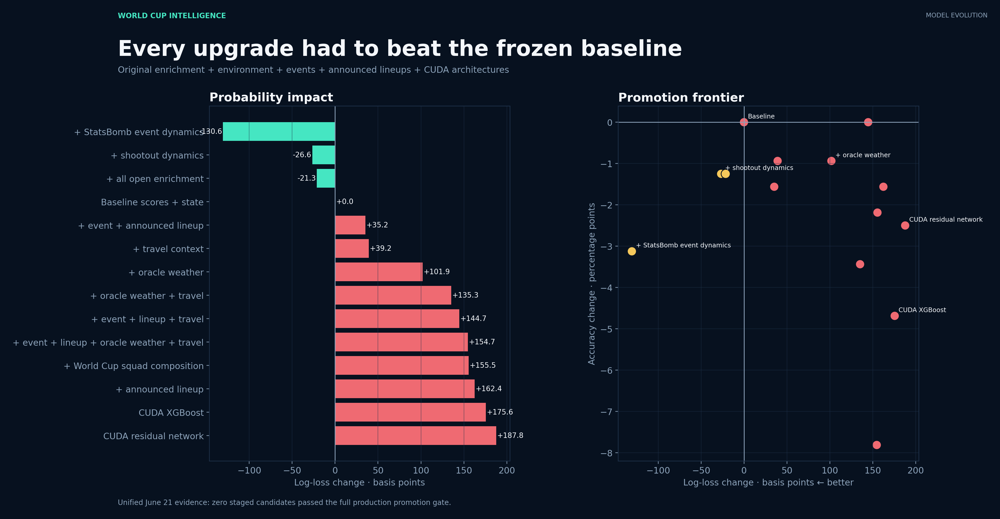

# World Cup Forecaster

I built a football model to answer one question that kept nagging me: if you train it
carefully and never let it cheat by peeking at results it is supposed to predict, how well
can it actually call World Cup games?

The project does two things:

- it gives the win / draw / loss chance for any international match, and
- it plays out the whole 2026 World Cup 5,000 times to estimate who reaches each round and
  who wins the trophy.

Then it grades itself on tournaments it never trained on, including the 2026 group stage,
which I locked in and froze before the opening match.

In short: it learns from about 49,000 international results going back to 1872, plus the
team-strength, form, rest and head-to-head context I rebuild before every game. Three models
share the work, a logistic regression, a gradient-boosting classifier, and a Dixon-Coles
Poisson goals model, blended together and calibrated so the probabilities can be trusted at
face value. The detail is further down.

[**Open the live World Cup Forecaster**](https://world-cup-forecaster.streamlit.app/)

> **Note:** Because of hosting, app may need a short cold start after being inactive. If it is
> waking up, please wait a moment for the model and dashboard to load.





[](https://github.com/uluutku/world-cup-forecaster/actions/workflows/ci.yml)


## Who does it think wins in 2026?

After simulating the tournament 5,000 times, these are the favourites:

| Team | Chance of winning | Chance of reaching the final |
|---|---:|---:|
| Argentina | 25.3% | 36.0% |
| Spain | 14.3% | 22.8% |
| Brazil | 11.2% | 21.2% |
| France | 9.7% | 19.7% |
| England | 9.3% | 19.5% |
| Colombia | 7.5% | 15.3% |
| Germany | 4.1% | 9.9% |
| Portugal | 2.6% | 6.1% |

How to read it: Argentina is the clear favourite, but 25% still means it fails to win about
three times out of four. That is the whole point. There is a lot of chance in football, and a
good model should tell you how uncertain things really are instead of pretending it knows the
winner.

## The honest test: predictions made before the tournament

Anyone can look clever after the fact. So before the 2026 opener I froze the model, wrote down
a prediction for all 72 group matches, and saved them with a timestamp. No result from the
tournament is allowed to change those predictions.

Out of the first 32 matches that have been played:

- it picked the correct outcome **59% of the time** (win, draw or loss),
- its probabilities scored a log loss of **0.955**, slightly better than its long-run average,
- and exactly **zero** of those 72 predictions were edited after kickoff.

I also tracked Türkiye on its own, because I am Turkish and wanted somewhere I could not fool
myself. The model favoured Türkiye in both of their completed games and was wrong both times.
I left that in. A predictor you only show when it is right is not worth much.



### Every prediction, game by game

The model got **19 of 32** right (59%). One thing worth knowing: it never names a draw as its
single most likely result, so most of its misses are games that ended level. The full ledger of
predictions made before the tournament:

<details>
<summary>All 32 group predictions (made before kickoff)</summary>

| Date | Match | Model's pick | Score | Result | Right? |
|---|---|---|---|---|:--:|
| Jun 11 | Mexico v South Africa | Mexico (85%) | 2-0 | Mexico | ✓ |
| Jun 11 | South Korea v Czech Republic | South Korea (43%) | 2-1 | South Korea | ✓ |
| Jun 12 | Canada v Bosnia and Herzegovina | Canada (72%) | 1-1 | Draw | ✗ |
| Jun 12 | United States v Paraguay | United States (38%) | 4-1 | United States | ✓ |
| Jun 13 | Australia v Türkiye | Türkiye (41%) | 2-0 | Australia | ✗ |
| Jun 13 | Brazil v Morocco | Brazil (53%) | 1-1 | Draw | ✗ |
| Jun 13 | Haiti v Scotland | Scotland (49%) | 0-1 | Scotland | ✓ |
| Jun 13 | Qatar v Switzerland | Switzerland (75%) | 1-1 | Draw | ✗ |
| Jun 14 | Germany v Curaçao | Germany (85%) | 7-1 | Germany | ✓ |
| Jun 14 | Ivory Coast v Ecuador | Ecuador (60%) | 1-0 | Ivory Coast | ✗ |
| Jun 14 | Netherlands v Japan | Netherlands (38%) | 2-2 | Draw | ✗ |
| Jun 14 | Sweden v Tunisia | Sweden (40%) | 5-1 | Sweden | ✓ |
| Jun 15 | Belgium v Egypt | Belgium (55%) | 1-1 | Draw | ✗ |
| Jun 15 | Iran v New Zealand | Iran (53%) | 2-2 | Draw | ✗ |
| Jun 15 | Saudi Arabia v Uruguay | Uruguay (59%) | 1-1 | Draw | ✗ |
| Jun 15 | Spain v Cape Verde | Spain (85%) | 0-0 | Draw | ✗ |
| Jun 16 | Argentina v Algeria | Argentina (63%) | 3-0 | Argentina | ✓ |
| Jun 16 | Austria v Jordan | Austria (53%) | 3-1 | Austria | ✓ |
| Jun 16 | France v Senegal | France (57%) | 3-1 | France | ✓ |
| Jun 16 | Iraq v Norway | Norway (62%) | 1-4 | Norway | ✓ |
| Jun 17 | England v Croatia | England (57%) | 4-2 | England | ✓ |
| Jun 17 | Ghana v Panama | Panama (51%) | 1-0 | Ghana | ✗ |
| Jun 17 | Portugal v DR Congo | Portugal (67%) | 1-1 | Draw | ✗ |
| Jun 17 | Uzbekistan v Colombia | Colombia (64%) | 1-3 | Colombia | ✓ |
| Jun 18 | Canada v Qatar | Canada (82%) | 6-0 | Canada | ✓ |
| Jun 18 | Czech Republic v South Africa | Czech Republic (51%) | 1-1 | Draw | ✗ |
| Jun 18 | Mexico v South Korea | Mexico (63%) | 1-0 | Mexico | ✓ |
| Jun 18 | Switzerland v Bosnia and Herzegovina | Switzerland (72%) | 4-1 | Switzerland | ✓ |
| Jun 19 | Brazil v Haiti | Brazil (85%) | 3-0 | Brazil | ✓ |
| Jun 19 | Scotland v Morocco | Morocco (57%) | 0-1 | Morocco | ✓ |
| Jun 19 | Türkiye v Paraguay | Paraguay (38%) | 0-1 | Paraguay | ✓ |
| Jun 19 | United States v Australia | United States (43%) | 2-0 | United States | ✓ |

</details>

## How it works, in plain terms

1. **Start with history.** Every senior international match since 1872, roughly 49,000 games.
2. **Build a snapshot before each match.** For both teams I track strength (an Elo rating with
   a sense of how confident it is), recent form, attack and defence quality, days of rest,
   tournament importance, home advantage, and head-to-head record. The one rule I never break:
   when the model predicts a game, it only sees what was known *before* kickoff. It never looks
   at the score it is trying to guess.
3. **Three models give an opinion.** A simple statistical model (logistic regression), a
   pattern-finder (gradient boosting), and a goals model that predicts actual scorelines
   (a Dixon-Coles Poisson process). They often disagree, which is useful information on its own.
4. **Blend and calibrate.** I combine the three and tune the result so that when the model says
   "70% chance", it really happens about 70% of the time.

## How good is it?

I retrained the whole thing from scratch before the 2006, 2010, 2014, 2018 and 2022 World Cups
and predicted each one without using any future match. That is 320 games it had never seen.

| World Cup | Got the result right | Probability score (log loss, lower is better) |
|---|---:|---:|
| 2006 | 65.6% | 0.862 |
| 2010 | 54.7% | 0.971 |
| 2014 | 59.4% | 0.919 |
| 2018 | 56.3% | 0.965 |
| 2022 | 53.1% | 1.081 |
| **Average** | **57.8%** | **0.960** |

Two things matter here. The model calls the right outcome about **58%** of the time, and on
probability quality it beats a sensible baseline (just using historical win/draw/loss rates) by
about **11%**. 2022 was its worst tournament by some distance, and I kept it in the table rather
than quietly dropping the fold that made the average look better.



## What I tried (and what actually worked)

This is the part I am most proud of, because the answer turned out to be "keep it simple".
Instead of throwing every dataset at the model and reporting the best number, I tested each
idea on its own, on the same World Cups, and only kept what genuinely helped both the
probability quality and the accuracy.

| What I added | Probability score | Accuracy | Verdict |
|---|---:|---:|---|
| Match results + team state (the baseline) | 0.960 | 57.8% | **kept** |
| + penalty shootout history | 0.957 | 56.6% | tiny probability gain, accuracy dropped → not worth it |
| + squad / player composition | 0.975 | 55.6% | got worse, the model overfit → rejected |
| + GPU XGBoost | 0.977 | 53.1% | trained fine, predicted worse → rejected |
| + GPU neural net (PyTorch) | 0.978 | 55.3% | same story → rejected |
| + travel and altitude | 0.964 | 56.9% | no help → rejected |
| + weather (looked up after the fact) | 0.970 | 56.9% | research only, you cannot know it before kickoff |
| + StatsBomb event data (2022 only) | 1.068 vs 1.081 | 50.0% | helped probabilities but I only had it for one tournament → kept as research |

The short version of the journey:

- I started with team strength and form. That is the baseline above.
- I expected fancier data to help. Penalty history gave a microscopic probability gain but cost
  accuracy. Squad and player data made it clearly worse, because there is not enough World Cup
  history to learn from without overfitting.
- I built a GPU XGBoost model and a PyTorch neural network to see if a heavier model would win.
  Both trained without trouble on a single GPU and both produced worse forecasts. I rejected
  them on the numbers, not on a bug.
- Weather and travel did nothing useful. Weather is also a trap, because you can only "know" the
  match-day weather after the fact, so I never let it into the real predictions.
- Event-level data (StatsBomb) was the one promising signal, but only on the 2022 World Cup,
  which is the only tournament I had full event data for. Not enough to promote it.

The best version, the one actually used for the 2026 predictions, is the boring one: a
calibrated blend of three simple models on basic match data. Knowing *why* the complicated
ideas lost is the real result.



## Try it yourself

The trained model is published as a release asset rather than committed to Git.

```bash
python -m venv .venv

# Windows
.venv\Scripts\activate
# macOS / Linux
source .venv/bin/activate

pip install -e .
worldcup-artifacts --url https://github.com/uluutku/world-cup-forecaster/releases/download/v2.0.0/world-cup-forecaster-v2.0.0.zip
streamlit run app.py
```

That opens the dashboard, where you can pick any two teams, see the forecast, simulate the
tournament, and dig into how the model behaves.

Prefer an API? Start it with `worldcup-api` and ask for a match:

```bash
curl -X POST http://localhost:8000/v1/predict \
  -H "Content-Type: application/json" \
  -d '{"home_team":"Brazil","away_team":"Argentina","neutral":true}'
```

You get back the win / draw / loss chances, the expected goals and most likely scoreline, and
how much the three models disagreed with each other.

## What it can't do

- This is a research project, not betting advice.
- It does not know about injuries, suspensions, starting line-ups or the mood in the dressing
  room. It works from results and team state only.
- Weather and announced line-ups are kept in a separate experiment, because that information
  only exists close to kickoff and using it in a historical test would be cheating.
- It is independent and has nothing to do with FIFA.

## Under the hood

Python, scikit-learn, a Dixon-Coles goals model, Monte Carlo tournament simulation, a FastAPI
service and a Streamlit dashboard. The training run rebuilds every feature in date order, checks
for leakage, runs the five-World-Cup backtest with bootstrap confidence intervals, and saves a
checksummed bundle. Reproduce it with:

```bash
pip install -e ".[dev]"
python -m worldcup_predictor.pipeline --refresh --simulations 5000
pytest
```

More detail lives in [docs/MODEL_CARD.md](docs/MODEL_CARD.md),
[docs/DATA_CARD.md](docs/DATA_CARD.md),
[docs/DATA_SOURCES.md](docs/DATA_SOURCES.md) and
[docs/ADVANCED_EXPERIMENTS.md](docs/ADVANCED_EXPERIMENTS.md). Data sources and their licences are
listed in [THIRD_PARTY_NOTICES.md](THIRD_PARTY_NOTICES.md).

## License

Code is MIT. The football datasets and anything derived from them keep their original terms,
described in [THIRD_PARTY_NOTICES.md](THIRD_PARTY_NOTICES.md).
</content>
