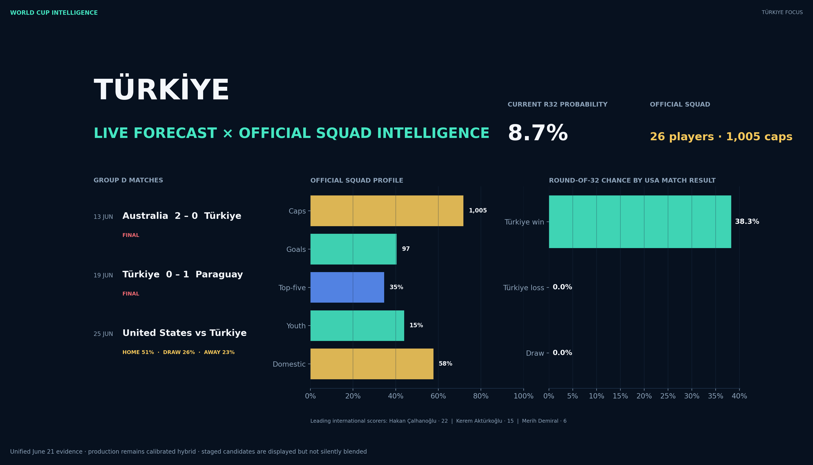

# World Cup Intelligence

I built this project to answer a simple question:

> How far can a properly evaluated football model go when predicting World Cup match outcomes?

The result is an end-to-end probabilistic forecasting system rather than a notebook with one
accuracy number. It builds every feature chronologically, compares model families on unseen World
Cups, calibrates the final probabilities, freezes blind forecasts before the 2026 tournament, and
serves the results through a dashboard and API.


[](https://github.com/uluutku/world-cup-intelligence/actions/workflows/ci.yml)


## What I tried

I started with 49,437 senior international matches and built a leakage-safe team state before every
kickoff. The state tracks rating uncertainty, form, momentum, attack and defence, schedule strength,
rest, tournament experience, venue context and head-to-head history.

The production model combines three different views of a match:

- regularized multinomial logistic regression;
- nonlinear histogram gradient boosting;
- a Dixon–Coles-adjusted Poisson goal process.

The blend weights and calibration temperature are learned on chronological validation data. Public
forecasts are presented as **home win, draw and away win probabilities**.

## Baseline results

I retrained the complete system before the 2006, 2010, 2014, 2018 and 2022 World Cups and predicted
each tournament without using future matches.

| Metric | Result |
|---|---:|
| Mean multiclass log loss | **0.960** |
| Historical-prior log loss | 1.075 |
| Probabilistic skill gain | **10.8%** |
| Outcome accuracy | **57.8%** |
| Bootstrap 95% log-loss interval | 0.908–1.012 |
| Evaluated World Cup matches | 320 |

The difficult 2022 fold is kept in the report. I did not remove the weakest tournament to improve the
headline result.


## The blind test

Before the 2026 opener, I froze the model and produced predictions for all 72 group fixtures. No
World Cup result is allowed to update that ledger.

After the first 32 completed matches:

- blind outcome accuracy: **59.4%**;
- blind log loss: **0.955**;
- tournament-state updates: **0**.

I also ran a separate Türkiye audit. The model favored Türkiye in both completed matches and was
wrong both times. Those failures remain visible.


## Did more data improve it?

I tested richer data as isolated feature families instead of automatically adding everything:

- historical FIFA rankings;
- scorer and shootout dynamics;
- historical World Cup squads;
- StatsBomb event and lineup data;
- travel, timezone, altitude and ERA5 weather;
- official 2026 squad structure;
- CUDA XGBoost and a residual PyTorch network.

The strongest new probability signal was StatsBomb event history on the 2022 fold, but accuracy fell
and the paired uncertainty interval crossed zero. Weather, travel, announced lineups and both GPU
models were worse than the calibrated hybrid.


| Candidate | Evaluation | Log loss | Accuracy | Decision |
|---|---:|---:|---:|---|
| Calibrated hybrid | 5 World Cups | **0.960** | **57.8%** | production |
| CUDA XGBoost | 5 World Cups | 0.977 | 53.1% | rejected |
| CUDA residual network | 5 World Cups | 0.978 | 55.3% | rejected |
| Travel context | 5 World Cups | 0.964 | 56.9% | rejected |
| ERA5 reanalysis | 5 World Cups | 0.970 | 56.9% | oracle only |
| StatsBomb events | 2022 only | **1.068** vs 1.081 | 50.0% | research only |
| Announced lineup | 2022 only | 1.097 | 51.6% | rejected |

The RTX 4070 Ti training path works. The GPU models were rejected because their forecasts were worse,
not because the implementation failed.


## Türkiye view

The Türkiye workspace combines:

- the immutable blind forecast;
- current win/draw/loss probabilities;
- outcome-conditioned tournament survival;
- all 26 official players;
- age, caps, international goals, position and club context;
- squad percentiles against the other 47 teams.

Squad intelligence is shown as context. It is not silently blended into production probabilities
because the historical squad experiments did not pass the promotion gate.



## Engineering work demonstrated

- chronological feature computation with explicit leakage tests;
- calibrated multiclass ensembles and probabilistic metrics;
- Dixon–Coles low-score dependence modeling;
- walk-forward tournament evaluation and bootstrap intervals;
- adaptive conformal prediction sets;
- Monte Carlo tournament simulation;
- event, lineup, weather and squad ingestion pipelines;
- CUDA XGBoost and PyTorch benchmark implementations;
- feature drift, ablation and reliability diagnostics;
- versioned promotion policy and immutable baseline artifacts;
- FastAPI inference service and a ten-workspace Streamlit application;
- checksum-verified release artifacts, Docker packaging and CI across Python 3.11–3.13.

## Run the published artifact

The fitted model is distributed as a checksum-verified GitHub Release asset rather than stored in Git
history.

```bash
python -m venv .venv

# Windows
.venv\Scripts\activate

# macOS / Linux
source .venv/bin/activate

pip install -e .
worldcup-artifacts --url https://github.com/uluutku/world-cup-intelligence/releases/download/v2.0.0/world-cup-intelligence-v2.0.0.zip
streamlit run app.py
```

API:

```bash
worldcup-api
```

```bash
curl -X POST http://localhost:8000/v1/predict \
  -H "Content-Type: application/json" \
  -d '{"home_team":"Brazil","away_team":"Argentina","neutral":true}'
```

The response contains calibrated win/draw/loss probabilities, model disagreement and experiment
lineage.

Docker:

```bash
WCI_ARTIFACT_BUNDLE_URL=https://github.com/uluutku/world-cup-intelligence/releases/download/v2.0.0/world-cup-intelligence-v2.0.0.zip docker compose up --build
```

## Reproduce the research

```bash
pip install -e ".[dev]"
python -m worldcup_predictor.pipeline --refresh --simulations 5000
python -m worldcup_predictor.advanced_pipeline
worldcup-promote
pytest --cov=worldcup_predictor
```

The release workflow repeats these steps from a version tag and publishes a runtime bundle plus its
SHA-256 checksum.

## Repository map

```text
src/worldcup_predictor/
├── features.py             chronological team-state engine
├── model.py                calibrated hybrid model
├── evaluation.py           backtests, calibration and uncertainty
├── simulation.py           48-team tournament simulation
├── event_data.py           StatsBomb event profiles
├── lineup_data.py          announced-lineup features
├── conditions.py           weather, altitude and travel research
├── architectures.py        CUDA model challengers
├── promotion.py            automated promotion gate
├── artifacts.py            release download and checksum verification
├── api.py                  FastAPI service
└── ui/                     dashboard workspaces
```

## Important boundaries

- This is probabilistic research, not betting advice.
- ERA5 weather is retrospective and is never treated as a deployable historical forecast.
- Starting lineups belong to a separate late-information model.
- The internal score process remains available for diagnostics, but public forecasts are outcome
  probabilities.
- The project is independent and is not affiliated with FIFA.

See [MODEL_CARD.md](docs/MODEL_CARD.md), [DATA_CARD.md](docs/DATA_CARD.md),
[ADVANCED_EXPERIMENTS.md](docs/ADVANCED_EXPERIMENTS.md) and
[THIRD_PARTY_NOTICES.md](THIRD_PARTY_NOTICES.md) for methodology and licensing details.

## License

Source code: MIT. Third-party datasets and derived artifacts retain their original terms as described
in [THIRD_PARTY_NOTICES.md](THIRD_PARTY_NOTICES.md).
