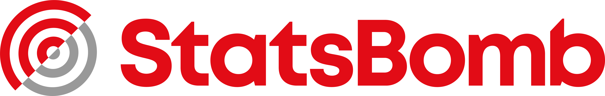

# Third-party data and attribution

The source code in this repository is licensed under MIT. Data and derived artifacts retain the
terms of their original providers.

## International results

Match results, goalscorers and shootouts are sourced from
[`martj42/international_results`](https://github.com/martj42/international_results), released under
CC0 1.0.

## Fjelstul World Cup Database

Historical World Cup match, stadium, player and squad data are derived from:

> Fjelstul, Joshua C. “The Fjelstul World Cup Database v1.2.0.” July 19, 2023.

Copyright © 2023 Joshua C. Fjelstul, Ph.D. The source database is licensed under
[CC BY-SA 4.0](https://creativecommons.org/licenses/by-sa/4.0/). This project normalizes names,
joins tables, computes historical squad aggregates and evaluates derived features. Derived data
artifacts based on this source are distributed under the same CC BY-SA 4.0 terms.

## StatsBomb Open Data

Event and lineup research uses [StatsBomb Open Data](https://github.com/statsbomb/open-data).
StatsBomb is identified as the data source wherever those findings are presented.

StatsBomb and its marks belong to their respective owners. Their inclusion is attribution, not an
endorsement of this project.

## Open-Meteo

Weather reanalysis, elevation and geocoding data are provided by
[Open-Meteo](https://open-meteo.com/) under CC BY 4.0. The project transforms these values into
normalized pre-match research features. ERA5 reanalysis is explicitly labeled as retrospective
oracle data.

Suggested citation:

> Zippenfenig, P. (2023). Open-Meteo.com Weather API. Zenodo.
> https://doi.org/10.5281/zenodo.7970649

## OpenFootball

The 2026 squad roster snapshot is sourced from
[`openfootball/worldcup.json`](https://github.com/openfootball/worldcup.json), dedicated to the
public domain under CC0 1.0.

## FIFA squad list

Caps, international goals and heights are reconciled from FIFA's published 2026 squad list. FIFA
names and tournament marks belong to FIFA. This project is independent and is not affiliated with,
endorsed by, or sponsored by FIFA.
